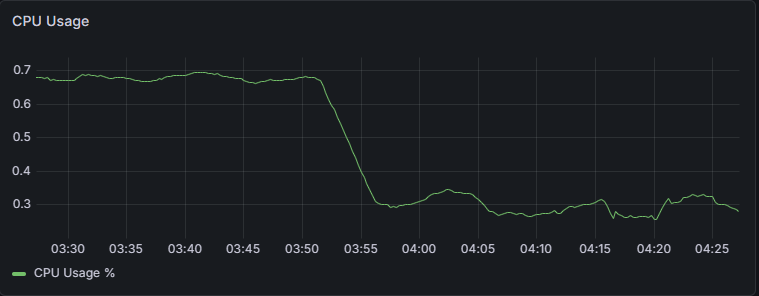
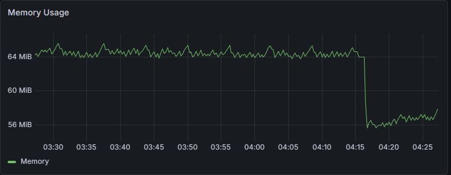

# SLA Guardian

> **Sistema de Monitoramento e Garantia de SLA em Tempo Real**

[](https://nodejs.org/)
[](https://www.typescriptlang.org/)
[](https://www.docker.com/)
[](https://redis.io/)
[](https://prometheus.io/)
[](https://grafana.com/)

---

## 📋 Sobre o Projeto

**SLA Guardian** é uma solução robusta e escalável para monitorar a disponibilidade de serviços em tempo real. Desenvolvido com foco em confiabilidade, o projeto implementa um sistema distribuído que:

✅ Monitora múltiplos endpoints simultaneamente  
✅ Implementa retry automático com backoff exponencial  
✅ Coleta métricas via Prometheus  
✅ Processa jobs de forma assíncrona e distribuída  
✅ Fornece alertas e observabilidade

---

## 🏗️ Arquitetura

```
┌──────────────────────────────────────────────────────────────────────┐
│                    SLA Guardian System                                │
├──────────────────────────────────────────────────────────────────────┤
│                                                                       │
│  ┌──────────────┐      ┌──────────────┐     ┌─────────────┐         │
│  │   Express    │◄────►│    Redis     │◄───►│  BullMQ     │         │
│  │     API      │      │   Message    │     │   Worker    │         │
│  │              │      │    Broker    │     │             │         │
│  └──────────────┘      └──────────────┘     └─────────────┘         │
│       :3000                  :6379          Scheduler/Retry          │
│       ↓                                                               │
│  ┌──────────────┐      ┌──────────────┐     ┌─────────────┐         │
│  │ Prometheus   │      │   Grafana    │     │  Dashboards │         │
│  │   :9090      │◄─────│   :3001      │◄────│  & Alerts   │         │
│  │              │      │              │     │             │         │
│  └──────────────┘      └──────────────┘     └─────────────┘         │
│  Coleta Métricas       Visualização         Performance Tracking    │
│                                                                       │
└──────────────────────────────────────────────────────────────────────┘
```

---

## 🚀 Tech Stack

| Camada           | Tecnologia     | Propósito                  |
| ---------------- | -------------- | -------------------------- |
| **Runtime**      | Node.js 20     | Ambiente JavaScript        |
| **Linguagem**    | TypeScript     | Type-safety e melhor DX    |
| **API**          | Express.js     | Servidor HTTP              |
| **Queue**        | BullMQ         | Processamento distribuído  |
| **Cache/PubSub** | Redis          | Fila, cache e broadcast    |
| **Scheduler**    | node-cron      | Execução agendada          |
| **HTTP Client**  | axios          | Requisições HTTP           |
| **Metrics**      | prom-client    | Exportação Prometheus      |
| **Monitoring**   | Prometheus     | Coleta e armazenagem       |
| **Dashboard**    | Grafana        | Visualização em tempo real |
| **Logging**      | Pino           | Logs estruturados          |
| **Container**    | Docker Compose | Orquestração               |

---

## ✨ Features Principais

| Recurso                          | Descrição                                                                        |
| -------------------------------- | -------------------------------------------------------------------------------- |
| 🔄 **Retry Automático**          | Exponential backoff, até 5 tentativas, tratamento robusto de falhas transitórias |
| 📊 **Monitoramento Real-time**   | Verificação a cada 30s, métricas por serviço, tempo de resposta individual       |
| ⚡ **Processamento Distribuído** | BullMQ para filas resilientes, múltiplos workers, jobs persistidos no Redis      |
| 🔔 **Alertas Multi-Canal** ⭐    | Console • Webhook • Slack • Email (com threshold + cooldown + recuperação)       |
| 📈 **Observabilidade**           | Prometheus metrics, health checks, logs estruturados                             |
| � **Dashboard Grafana** ✨       | Visualização de performance, CPU, memória, taxa de requisições em tempo real     |

---

## 🚀 Quick Start

### Pré-requisitos

- Docker & Docker Compose
- Node.js 20+
- npm 10+

### Instalação (1 minuto)

```bash
# Clonar repositório
git clone https://github.com/seu-usuario/sla-guardian.git
cd sla-guardian

# Instalar dependências
npm install
cd api && npm install && cd ..
cd worker && npm install && cd ..
```

### Executar com Docker Compose

```bash
docker-compose up --build
```

Serviços iniciados:

- 🔵 **API**: http://localhost:3000
- 📊 **Métricas Prometheus**: http://localhost:3000/metrics
- 📈 **Prometheus**: http://localhost:9090
- 📊 **Grafana Dashboard**: http://localhost:3001 (admin/admin)
- 📮 **Redis**: localhost:6379

### Testar a API

```bash
# Health check
curl http://localhost:3000/health
# {"status":"ok"}

# Endpoint raiz
curl http://localhost:3000/
# {"message":"SLA Guardian API running 🚀"}

# Métricas Prometheus
curl http://localhost:3000/metrics
# # HELP process_cpu_user_seconds_total Total user CPU time spent...
```

### Acessar Grafana Dashboard

1. Abra http://localhost:3001
2. Login: **admin** / **admin**
3. Navegue para **Dashboards → SLA Guardian - Performance Dashboard**
4. Visualize métricas em tempo real de CPU, memória, requisições e status da API

---

## Endpoints da API

| Método | Endpoint   | Descrição                      | Status | Acesso                        |
| ------ | ---------- | ------------------------------ | ------ | ----------------------------- |
| GET    | `/health`  | Verificar saúde da API         | ✅ 200 | http://localhost:3000/health  |
| GET    | `/`        | Informação geral da API        | ✅ 200 | http://localhost:3000/        |
| GET    | `/metrics` | Métricas em formato Prometheus | ✅ 200 | http://localhost:3000/metrics |

### Exemplo de Resposta

```json
// GET /health
{
  "status": "ok"
}

// GET /
{
  "message": "SLA Guardian API running 🚀"
}

// GET /metrics (Prometheus format)
# HELP process_cpu_user_seconds_total Total user CPU time spent...
# TYPE process_cpu_user_seconds_total counter
```

---

## Dashboard Grafana

O SLA Guardian inclui um **dashboard pré-configurado** com visualização de métricas em tempo real.

### Painéis Disponíveis

| Painel            | Descrição                       | Métrica                                     |
| ----------------- | ------------------------------- | ------------------------------------------- |
| **CPU Usage**     | Uso de CPU em percentual        | `rate(process_cpu_seconds_total[5m]) * 100` |
| **Memory Usage**  | Memória residente do processo   | `process_resident_memory_bytes`             |
| **Request Rate**  | Taxa de requisições por segundo | `rate(http_requests_total[1m])`             |
| **API Status**    | Indicador de saúde (UP/DOWN)    | `up{job="sla-guardian-api"}`                |
| **Response Time** | Latência p95 e p99              | `histogram_quantile(0.95/0.99, ...)`        |
| **Success Rate**  | Taxa de sucesso vs erros        | `http_requests_total{status=~"..."}`        |

### Acesso ao Dashboard

```
URL: http://localhost:3001
Usuário: admin
Senha: admin
Dashboard: SLA Guardian - Performance Dashboard
```

### Visualização do Dashboard

<div align="center">
  <table>
    <tr>
      <td align="center">
        
      </td>
      <td align="center">
        
      </td>
    </tr>
  </table>
</div>

---

Crie ou edite `.env` nos diretórios:

### `api/.env`

```env
PORT=3000
REDIS_HOST=redis
REDIS_PORT=6379
```

### `worker/.env`

```env
REDIS_HOST=redis
REDIS_PORT=6379
TARGET_URL=https://google.com
SECONDARY_URL=https://example.com
```

---

## Sistema de Alertas Inteligente

O SLA Guardian possui um sistema robusto de notificações multi-canal que permite enviar alertas através de diferentes plataformas.

### Canais Disponíveis

#### Console (Padrão)

Exibe alertas no terminal do worker. Perfeito para desenvolvimento.

```bash
┌─────────────────────────────────────────────────────────┐
│ ❌ ALERTA DE MONITORAMENTO
├─────────────────────────────────────────────────────────┤
│ Serviço:     https://google.com
│ Status:      FAILURE
│ Mensagem:    Falha ao verificar serviço
│ Tempo:       29/04/2026 14:30:45
│ Erro:        getaddrinfo ENOTFOUND
│ Tentativas:  3/5
│ Duração:     0ms
└─────────────────────────────────────────────────────────┘
```

#### Webhook Genérico

Envie alertas para qualquer URL que aceite POST HTTP.

```env
WEBHOOK_URL=https://seu-servidor.com/alerts
```

Payload enviado:

```json
{
  "alert": {
    "service": "https://google.com",
    "status": "failure",
    "message": "Falha ao verificar serviço",
    "error": "Timeout exceeded",
    "duration": 5000,
    "timestamp": "2026-04-29T14:30:45.000Z"
  },
  "metadata": {
    "project": "SLA Guardian",
    "environment": "production",
    "version": "1.0.0"
  }
}
```

#### Slack

Integração nativa com Slack para notificações em tempo real.

```env
SLACK_WEBHOOK_URL=https://hooks.slack.com/services/YOUR/WEBHOOK/URL
```

**Como obter Webhook URL do Slack:**

1. Acesse https://api.slack.com/apps
2. Crie uma nova app ou selecione existente
3. Vá em "Incoming Webhooks"
4. Ative e clique em "Add New Webhook to Workspace"
5. Selecione o canal desejado
6. Copie o URL gerado

#### Email

Notificações por email via SMTP.

```env
SMTP_HOST=smtp.gmail.com
SMTP_PORT=587
SMTP_SECURE=false
SMTP_USER=seu-email@gmail.com
SMTP_PASS=sua-senha-ou-app-password
SMTP_FROM=sla-guardian@example.com
ALERT_EMAIL=admin@example.com
```

**Configuração Gmail:**

1. Ative "Menos segurança" ou use "Senha de Aplicativo"
2. Para 2FA, gere uma app-specific password
3. Use a app-specific password no `SMTP_PASS`

### Configuração de Alertas

```env
# Console (sempre ativo)

# Webhook customizado
WEBHOOK_URL=https://seu-webhook.com/alerts

# Slack
SLACK_WEBHOOK_URL=https://hooks.slack.com/services/...

# Email
SMTP_HOST=smtp.gmail.com
SMTP_PORT=587
SMTP_USER=seu-email@gmail.com
SMTP_PASS=app-password
ALERT_EMAIL=admin@example.com
```

### Lógica de Alertas

- **Threshold**: Dispara alerta apenas após 3 falhas consecutivas
- **Cooldown**: Evita spam com intervalo de 5 minutos entre alertas do mesmo serviço
- **Recuperação**: Notifica automaticamente quando o serviço volta a funcionar
- **Context**: Inclui número de tentativas, duração e erro específico

---

## 📁 Estrutura do Projeto

```
sla-guardian/
├── api/
│   ├── src/
│   │   └── index.ts          # Express server + Prometheus
│   ├── Dockerfile
│   ├── package.json
│   ├── tsconfig.json
│   └── .env
│
├── worker/
│   ├── src/
│   │   ├── index.ts          # Entry point
│   │   ├── monitor.ts        # BullMQ + Worker logic
│   │   ├── scheduler.ts      # Health check scheduling
│   │   ├── alert.ts          # 🔔 Alert manager
│   │   ├── notifications.ts  # 📮 Canais de notificação
│   │   ├── retry.ts          # Retry logic
│   │   └── types.ts          # TypeScript definitions
│   ├── Dockerfile
│   ├── package.json
│   ├── tsconfig.json
│   └── .env
│
├── grafana-provisioning/
│   ├── datasources/
│   │   └── prometheus.yml    # Data source Prometheus
│   └── dashboards/
│       ├── dashboards.yml
│       └── sla-guardian-dashboard.json  # 📊 Dashboard pré-configurado
│
├── prometheus.yml            # Config scraping
├── docker-compose.yml        # Orquestração com Prometheus + Grafana
├── .env.example
├── .gitignore
└── README.md
```

---

## 📈 Prometheus & Observabilidade

O SLA Guardian exporta métricas em formato Prometheus padrão, permitindo integração com qualquer sistema de monitoramento.

### Scraping Automático

Prometheus está configurado para scrappear métricas a cada **15 segundos** da API:

```yaml
# prometheus.yml
scrape_configs:
  - job_name: "sla-guardian-api"
    static_configs:
      - targets: ["api:3000"]
    metrics_path: "/metrics"
    scrape_interval: 15s
```

### Métricas Coletadas

- **Node.js Runtime**: CPU, memória, garbage collection, event loop
- **HTTP**: Requisições, latência, status codes
- **Custom**: (Pronto para expandir com métricas de negócio)

### Acesso ao Prometheus

```
URL: http://localhost:9090
Query: Explore métricas em tempo real
Alertas: Configure alertas baseados em thresholds
```

---

## 🔔 Alertas Inteligentes no Grafana

O SLA Guardian agora inclui um sistema completo de alertas integrado com Prometheus e Alertmanager, permitindo notificações em múltiplos canais.

### Arquitetura de Alertas

```
Prometheus (regras)
    ↓
Alertmanager (roteamento)
    ↓
Slack | Email | Webhook | Grafana
```

### Alertas Pré-configurados

| Alerta                    | Condição                      | Severidade | Ação          |
| ------------------------- | ----------------------------- | ---------- | ------------- |
| 🔴 API Unresponsive       | API offline > 2 min           | Crítico    | Slack + Email |
| 🟠 High Error Rate        | Taxa de erro > 5% por 5 min   | Aviso      | Slack         |
| 🟠 High Latency           | P95 latência > 1s por 5 min   | Aviso      | Slack         |
| 🔴 Critical Latency       | P99 latência > 5s por 2 min   | Crítico    | Slack + Email |
| 🟠 High Memory Usage      | Memória > 85% por 10 min      | Aviso      | Slack         |
| 🟠 High CPU Usage         | CPU > 80% por 10 min          | Aviso      | Slack         |
| ℹ️ Unusual Traffic        | Requisições > 100/s por 5 min | Info       | Slack         |
| 🔴 Multiple Services Down | 2+ serviços offline por 1 min | Crítico    | Escalação     |

### Configurar Notificações por Slack

1. **Criar Webhook do Slack**:
   - Acesse: https://api.slack.com/apps
   - Crie uma app: "SLA Guardian Alerts"
   - Vá para: **Incoming Webhooks** → **Add New Webhook**
   - Selecione canal: #alerts
   - Copie a URL

2. **Configurar no Alertmanager**:
   - Edite `.env` ou `.env.alerts.example`:
     ```bash
     SLACK_WEBHOOK_URL=https://hooks.slack.com/services/YOUR/WEBHOOK/URL
     ```

3. **Reiniciar Alertmanager**:
   ```bash
   docker-compose restart alertmanager
   ```

### Configurar Notificações por Email

1. **Gmail com App Password**:
   - Ative 2-Step Verification em: https://myaccount.google.com/security
   - Vá para: https://myaccount.google.com/apppasswords
   - Gere app password para Mail
   - Copie a senha

2. **Configurar no `.env`**:
   ```bash
   SMTP_PASSWORD=xxxx xxxx xxxx xxxx
   SMTP_USER=seu-email@gmail.com
   ALERT_EMAIL=admin@example.com
   ```

### Webhook Customizado

Configure um endpoint próprio para receber alertas:

```bash
WEBHOOK_URL=https://seu-servidor.com/webhooks/alerts
```

Payload recebido:

```json
{
  "status": "firing",
  "alerts": [
    {
      "status": "firing",
      "labels": {
        "alertname": "APIUnresponsive",
        "severity": "critical"
      },
      "annotations": {
        "summary": "API não está respondendo",
        "description": "API em api:3000 offline > 2 min"
      }
    }
  ]
}
```

### Interfaces de Alerta

| Serviço      | URL                          | Descrição                          |
| ------------ | ---------------------------- | ---------------------------------- |
| Prometheus   | http://localhost:9090/alerts | Ver alertas disparados             |
| Alertmanager | http://localhost:9093        | Gerenciar alertas e silenciamentos |
| Grafana      | http://localhost:3001        | Dashboard + histórico de alertas   |

### Testar Alertas

```bash
# Ver script de teste
bash guides/test-alerts-grafana.sh

# Simular falha da API (vai disparar alerta)
docker-compose stop api
# Esperar 2+ minutos...
docker-compose start api
```

### Documentação Completa

Veja [Guia de Alertas no Grafana](./guides/ALERTS_GRAFANA.md) para:

- ✅ Configuração passo-a-passo
- ✅ Integrações com Discord, Teams, PagerDuty
- ✅ Templates de mensagens customizadas
- ✅ Silenciamento de alertas
- ✅ Regras de inibição (evitar duplicatas)
- ✅ Troubleshooting

---

## 🧪 Desenvolvimento Local (sem Docker)

### Terminal 1 - Redis

```bash
docker run -p 6379:6379 redis:7-alpine
```

### Terminal 2 - API

```bash
cd api && npm run dev
```

### Terminal 3 - Worker

```bash
cd worker && npm run dev
```

### Terminal 4 - Logs

```bash
# Testar endpoints
curl http://localhost:3000/health
```

---

## 🔄 Fluxo de Monitoramento

```
1. Scheduler (a cada 30s)
   ↓
2. Cria job na fila Redis
   ↓
3. Worker processa job
   ↓
4. Tenta acessar URL com timeout 5s
   ↓
5. Sucesso?
   ├─ Sim → Log + Métrica ✅
   └─ Não → Retry com backoff exponencial
   ↓
6. Max retries?
   ├─ Sim → Falha registrada 🔥
   └─ Não → Tenta novamente
```

---

## 📊 Exemplo de Saída

```bash
$ docker-compose up

sla-guardian-redis    | Ready to accept connections
sla-guardian-api     | 🔧 Iniciando SLA Guardian API...
sla-guardian-api     | API rodando na porta 3000
sla-guardian-worker  | 🔧 Iniciando SLA Guardian Worker...
sla-guardian-worker  | ✅ Worker rodando e pronto para monitorar serviços
sla-guardian-worker  | 🚀 Scheduler de health check iniciado

// Após 30 segundos:
sla-guardian-worker  | ⏱️ Enviando job de monitoramento...
sla-guardian-worker  | 🔎 Verificando: https://google.com
sla-guardian-worker  | ✅ https://google.com OK - Status: 200 - 145ms
sla-guardian-worker  | 🎉 Job 1 concluído
```

---

## 🎓 Aprendizados & Conceitos Demonstrados

### 🏗️ Arquitetura Distribuída

- Padrão Message Queue (BullMQ)
- Desacoplamento de serviços
- Event-driven architecture
- Task scheduling com cron

### 🛡️ Resiliência & Confiabilidade

- Retry automático com backoff exponencial
- Tratamento de falhas transitórias
- Graceful shutdown e sinais do sistema
- Validação e error handling robusto

### 📈 Observabilidade & Monitoramento

- Prometheus metrics para análise
- Health checks estruturados
- Logs estruturados (Pino)
- Rastreamento de performance

### 💻 Stack Técnico

- **TypeScript** - Type-safe em 100% do código
- **Express.js** - API REST escalável e segura
- **BullMQ** - Processamento distribuído de jobs
- **Redis** - Fila resiliente e broker de mensagens
- **Prometheus** - Coleta e análise de métricas
- **Grafana** - Visualização em dashboard
- **Docker** - Containerização e orquestração

### 🚀 DevOps & Infrastructure

- Docker & Docker Compose para multi-container
- Prometheus para scraping automático de métricas
- Grafana com dashboard pré-configurado
- Environment management (.env)
- CI/CD ready (sem dependências externas)
- Configuration as Code
- Provisioning automático de data sources e dashboards

---

## 🛑 Parar Serviços

```bash
docker-compose down
# ou Ctrl+C nos terminais
```
